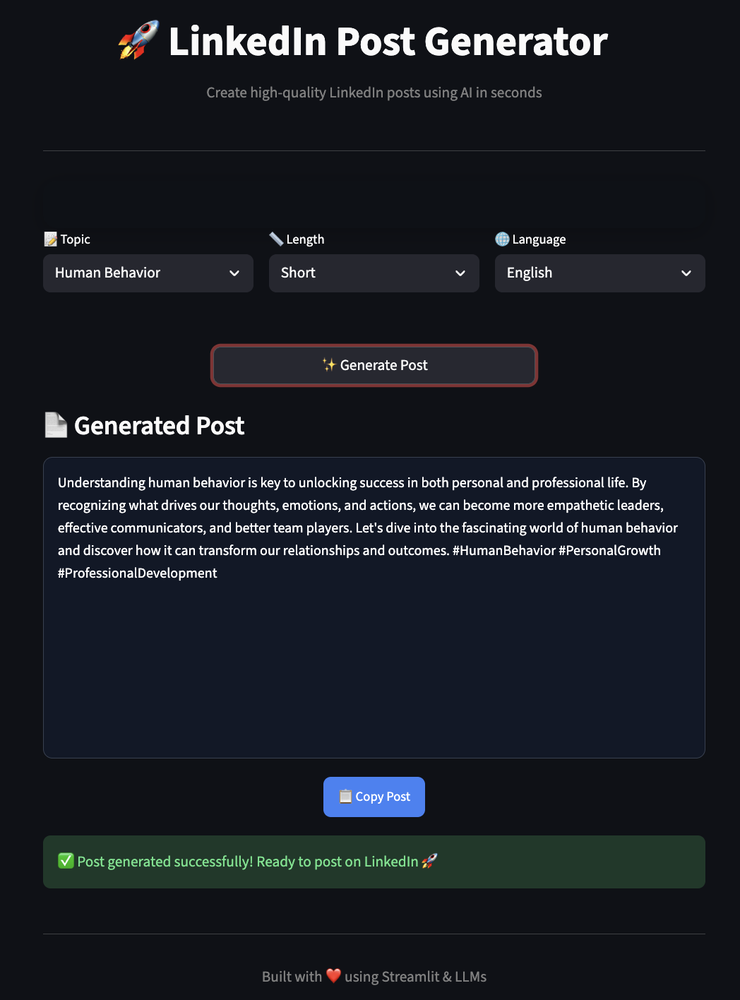

## Wokring App Link 
https://contentify-ai.streamlit.app/

An **AI-powered LinkedIn content generation system** that analyzes a user’s historical LinkedIn posts and generates new, highly personalized posts using **LLMs, prompt chaining, and few-shot learning**, all through an interactive **Streamlit interface**.
---

## ✨ Features

- 🔍 **LLM-Based Semantic Tag Extraction**  
  Automatically analyzes a user’s past LinkedIn posts using a prompt-chained LLM to generate meaningful semantic tags.

- 🗂 **Data Enrichment Pipeline**  
  Enhances raw post data with structured metadata including:
  - Tags  
  - Language (English / Hinglish)  
  - Post length (Short / Medium / Long)  
  Stored efficiently in JSON format for reuse.

- 🧠 **Personalized Post Generation**  
  Dynamically selects few-shot examples from the user’s own historical posts to preserve writing style, tone, and language consistency.

- 🎛 **Interactive Streamlit UI**  
  Allows users to control content generation via inputs:
  - Topic / Tag  
  - Language  
  - Post Length  

- 📋 **Soft-Wrapped Output with Copy Button**  
  Displays generated posts in a clean, readable format with a centered one-click copy button.

---

## 🏗 High-Level Architecture

1. Ingest user’s historical LinkedIn posts  
2. Use LLM chaining with prompt templates for semantic tag extraction  
3. Store enriched post data (tags, language, length) in JSON files  
4. Collect user preferences through Streamlit UI  
5. Generate new posts using dynamic prompts and few-shot examples  
6. Output personalized LinkedIn-ready content  

---

## 🧰 Tech Stack

- **Programming Language**: Python  
- **Frontend**: Streamlit  
- **LLMs**: OpenAI / Gemini (configurable)  
- **Techniques**:
  - Prompt Engineering  
  - Few-Shot Learning  
  - LLM Chaining  
  - Semantic Tagging  
- **Data Storage**: JSON  
- **Libraries**: Pandas  

---




## 🚀 Getting Started

### Clone the Repository
```bash

# 1. Clone the repository
git clone https://github.com/harshitMrt/LinkedIn_Post_Generator.git
cd LinkedIn_Post_Generator

# 2. Create virtual environment
python3 -m venv venv

# 3. Activate virtual environment
source venv/bin/activate        # macOS / Linux
# venv\Scripts\activate         # Windows

# 4. Upgrade pip
pip install --upgrade pip

# 5. Install dependencies
pip install streamlit pandas python-dotenv groq

# 6. Create .env file (if not already present)
touch .env

# 7. Add Groq API key
echo "GROQ_API_KEY=your_groq_api_key_here" >> .env

# 8. (Optional) Run preprocessing scripts
python preprocess.py
python fix_data.py

# 9. Run Streamlit app
streamlit run main.py

```
### This project is a personalized LinkedIn content engine.

1. I first ingest a user’s historical LinkedIn posts and use a chained LLM with prompt templates to extract semantic tags.
2. I then enrich the data with metadata like language and post length and store it in structured JSON files.
3. During generation, I dynamically select few-shot examples from the user’s own posts and build a controlled prompt using user preferences collected via Streamlit.
4. This ensures the generated content matches the user’s original writing style while reducing hallucinations.
